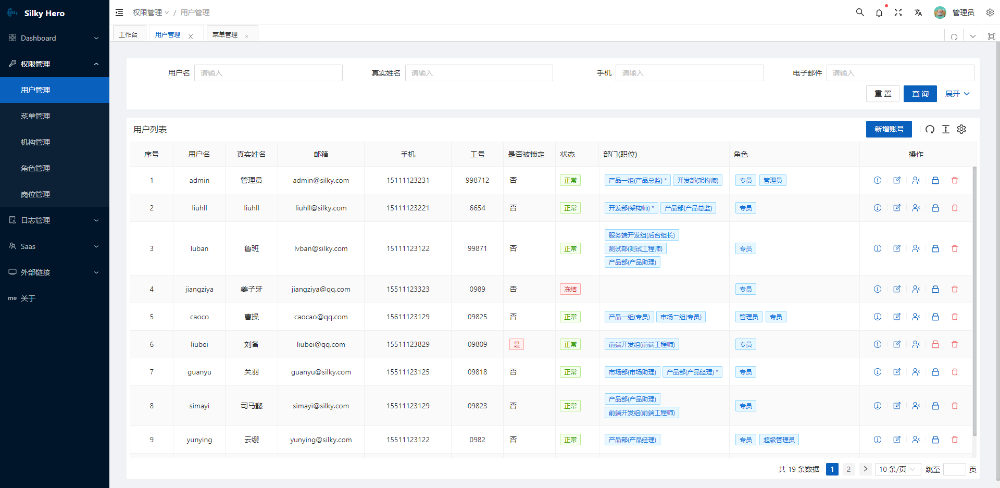
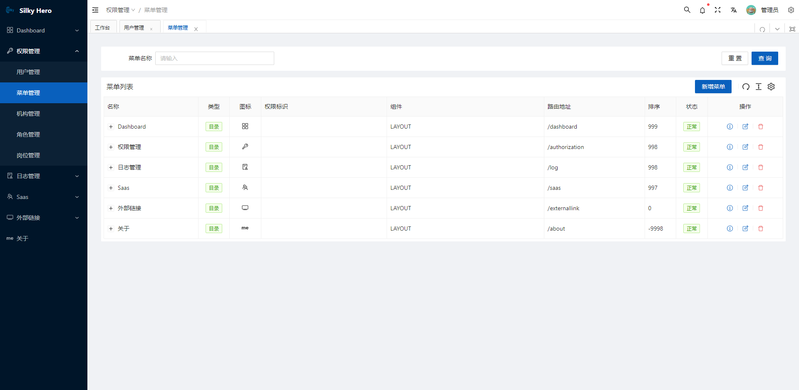
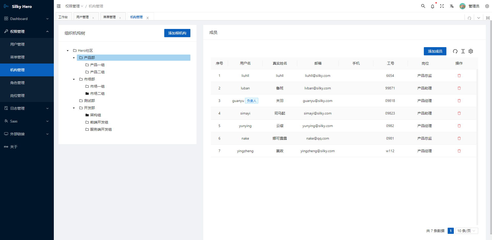
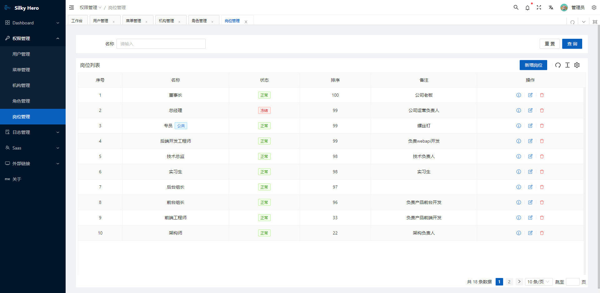
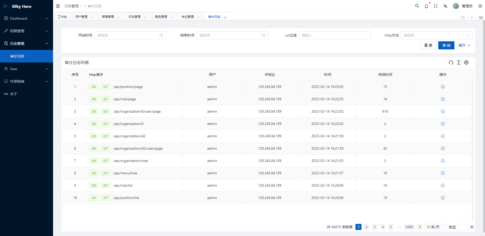
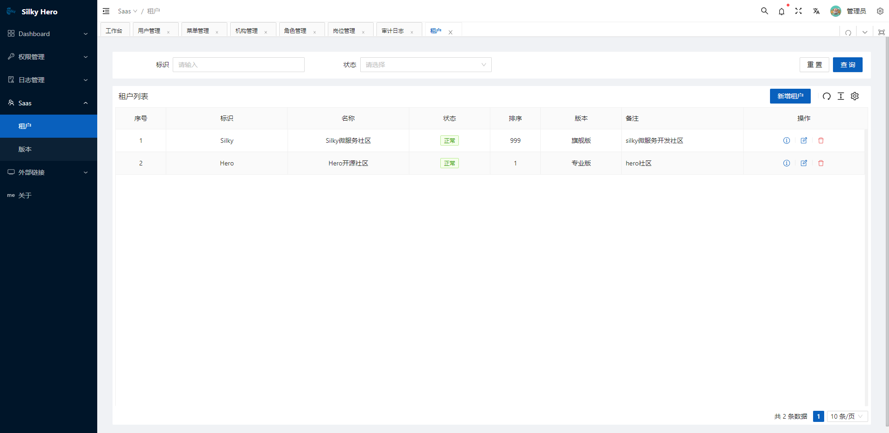

# Silky.Hero 后台管理系统

[](./LICENSE)
[](https://img.shields.io/github/last-commit/liuhll/silky.hero)
[](https://hits.seeyoufarm.com)

## 项目简介
Silky.Hero是基于[Silky微服务框架](https://docs.silky-fk.com/)开发的[RBAC权限管理系统](https://zhuanlan.zhihu.com/p/104849603),开发者可以根据该框架快速构建一个业务管理系统。

演示地址: https://hero.silky-fk.com/  

管理员: amdin  密码: 123qweR!

普通用户: liuhll 密码:123qweR!

## 内置功能

1. 用户管理：用户是系统操作者，该功能主要完成系统用户配置。
2. 部门管理：配置系统组织机构（公司、部门、小组），树结构展现支持数据权限。
3. 岗位管理：配置系统用户所属担任职务。
4. 菜单管理：配置系统菜单，操作权限，按钮权限标识等。
5. 角色管理：角色菜单权限分配、设置角色按机构进行数据范围权限划分。
6. 字典管理：对系统中经常使用的一些较为固定的数据进行维护。
7. 审计日志：系统正常操作日志记录和查询；系统异常信息日志记录和查询。
8. 租户管理: 管配置系统所有的的租户以及该租户所属的系统版本。
9. 版本管理: 指定系统版本以及版本功能。
10. 系统接口：根据业务代码自动生成相关的swagger webapi接口文档。

## 微服务列表

|  标识  | 微服务 | 描述 | 数据库  | 备注 |
| :---- | :------ | :---- | :------- | :------- |
| Account | 账户 | 主要负责用户登陆认证、获取当前登陆用户信息等服务 | Silky.Identity | 与`Identity`服务共享数据以及领域服务 |
| BasicData | 基础数据 | 主要维护系统中较为固定的基础数据(如字典)的服务 | Silky.BasicData | |
| Identity | 身份信息 | 负责系统中的用户、角色等数据的维护以及功能权限、数据权限的授权管理 | Silky.Identity | |
| Organization | 组织机构 | 负责维护组织机构的数据以及相关业务服务 | Silky.Organization | |
| Position | 岗位 | 负责维护岗位的数据以及相关业务服务 | Silky.Position | |
| Permission | 权限 | 负责系统中功能以及菜单的数据维护以及对接口的授权认证服务 | Silky.Permission | |
| Saas | 软件运营 | 负责维护系统所有的功能以及系统版本能力 | Silky.Saas | |
| Log | 日志 | 负责维护系统中生成的日志信息 | Silky.Log | |
| Gateway | 网关 | 负责集群对外提供统一的webapi,以及通过调用`Permission`提供的接口实现对访问借口的授权 | | |


## 开发环境

Silky.Hero默认使用[Nacos](https://nacos.io/zh-cn/)作为服务注册中心和服务配置中心,使用Mysql作为数据库服务器;

1. 进入到`deploy/docker-compose/infrastr`目录,通过如下命令快速安装部署Nacos服务:

```shell

docker network create silky_service_net # 首先通过该命令创建 silky_service_net 虚拟网络

docker-compose -f docker-compose.nacos.mysql.yaml up -d # 运行 nacos集群以来的数据库服务

docker-compose -f docker-compose.nacos.cluster-hostname.yaml up -d # 等待 mysql服务启动后再运行该命令启动nacos集群服务

```

2. 等nacos服务启动成功后,通过浏览器打开 *https://127.0.0.1:8848/nacos* ，通过账号/密码:nacos/nacos登陆管理端,然后创建`silky`和`silky_hero_config`名称空间,然后通过**配置管理/配置管理/导入配置**功能将位于`services/Shared/Configs/silky.hero.dev.zip`的配置包导入到nacos系统中;

3. 通过如下命令启动redis服务

```shell

docker-compose -f docker-compose.redis.yaml up -d

```

3. 通过如下命令启动rabbitmq服务

```shell

docker-compose -f docker-compose.rabbitmq.yaml up -d

```

4. 通过如下命令启动mysql服务

```shell

docker-compose -f docker-compose.mysql.yaml up -d

```

5. 通过IDE *Visual Studio* 或是 *Rider(推荐)* 打开解决方案`Services/Silky.Hero.sln`后进行开发调试;应用启动后,系统将自动创建数据库和新增种子数据。

> Notes
>
>  silky还支持使用Zookeeper或是Consul作为服务注册中心,使用Apllo作为服务配置中心,您可以查看[官方文档](https://docs.silky-fk.com/)或是[教学视频](https://space.bilibili.com/354560671/channel/seriesdetail?sid=2797330)来学习如何使用和配置。


## docker镜像打包

进入`build`目录后,可以通过`build-push-images.ps1`脚本实现对各个为服务应用的源码构建和docker镜像打包,通过`Services`指定需要构建的微服务应用;

```shell

./build-push-images.ps1

```

该脚本有如下的参数:

|  参数名  | 描述 | 缺省值 | 备注 |
| :---- | :------ | :---- | :------- |
|  publish  | 构建源码并执行发布 | $true |  |
|  clean  | 构建源码时是否清理本地nuget包缓冲| $false | 构建发布源码时生效  |
|  buildImages  | 是否构建docker镜像 | $true |  |
|  pushImages  | 是否推送docker镜像到镜像仓库 | $false |  |
|  imageTag  | 制定的镜像Tag |  | 默认值为`latest`  |
|  registry  | docker仓库地址 | |  推送时生效，为空时默认推送到官方仓库|
|  dockerUser  | 仓库用户名 | | 推送时生效 |
|  dockerPwd  | 仓库密码 | | 推送时生效 |

## 部署

在silky.hero集群部署之前,我们需要先将微服务集群依赖的基础服务如: Nacos、Redis、RabbitMq、MySQL等服务部署好,您可以参考上文[开发环境](#开发环境)搭建中如何通过docker-compose将上述所说的基础服务快速部署好。

在silky.hero集群部署之前,您需要对源码进行docker镜像打包,或是已经将docker镜像推送到docker镜像仓库中。

### docker-compose部署

在基础服务搭建好后,进入目录`deploy/docker-compose/services.nacos`:

1. 环境变量的调整: 您可以通过 .env文件修改指定的配置参数,如: nacos的服务地址或是应用服务集群指定配置的名称空间等参数,如下所示:

```shell
TAG=latest # 指定docker镜像版本
nacosConfig__namespace=silky_hero_nocas_dev # 指定服务配置的名称空间
nacosConfig__listeners__1__dataId=silky.hero.nacos.common.nacos # 指定服务配置监听的服务配置中心类型
nacosConfig__userName=nacos # nacos用户名，缺省值为nacos
nacosConfig__password=nacos # nacos密码，缺省值为nacos
nacosConfig__namingUseRpc=true # 服务注册是否使用gRPC协议和服务端对接,缺省值为true
nacosConfig__configUseRpc=true # 配置读取是否使用gRPC协议和服务端对接，缺省值为true
nacosConfig__serverAddresses__0=http://127.0.0.1:8848/ # nacos服务地址
nacosConfig__serverAddresses__1=http://127.0.0.1:8849/
nacosConfig__serverAddresses__2=http://127.0.0.1:8850/
# ...其他配置参数可以参考nacos文档
```

在部署的时候可以根据实际环境调整环境变量参数以及要导入的配置参数的包(*silky.hero.demo.zip*/*silky.hero.dev.zip*),开发者可以根据实际情况对配置的压缩包内的配置文件的参数进行调整,然后将配置导入到相应的名称空间。

> Notes
>
> `nacosConfig__listeners__1__dataId`配置项可以指定: `silky.hero.nacos.common.consul`或是`silky.hero.nacos.common.zookeeper`,当然您需要根据您指定的配置项来搭建相应的服务注册中心集群来配置使用.

2. 网关部署

网关承担了集群流量的入口,需要对宿主机映射http端口,使用docker-compose部署的时候无法通过命令行对网关进行扩缩容,但是可以通过调整`docker-compose.gateway.yaml`来实现对网关的扩缩容,每个网关的实例可以映射到宿主机不同的端口,然后通过nginx的反向代理实现对网关的负载均衡。

```shell

docker-compose -f docker-compose.gateway.yaml up -d

```

4. 业务服务的部署

```shell

docker-compose -f docker-compose.yaml up -d # 启动所有的服务,每个业务服务的实例为1

# 服务的扩缩容

docker-compose -f docker-compose.yaml up --scale silky.permission=2 --scale silky.identity=3 --scale silky.organization=2 --scale silky.log=2 --scale silky.account=2 -d #对指定部署的服务指定要部署的实例数量

```

### k8s部署

即将更新

## 前端

您可以通过前端项目的[READNE.md](./frontend/README.md)来了解前端项目。

## 演示图

<table>
    <tr>
        <td></td>
        <td></td>
    </tr>
    <tr>
        <td></td>
        <td></td>
    </tr>
    <tr>
        <td></td>
        <td></td>
    </tr>
    <tr>
        <td></td>
        <td></td>
    </tr>
 
</table>
